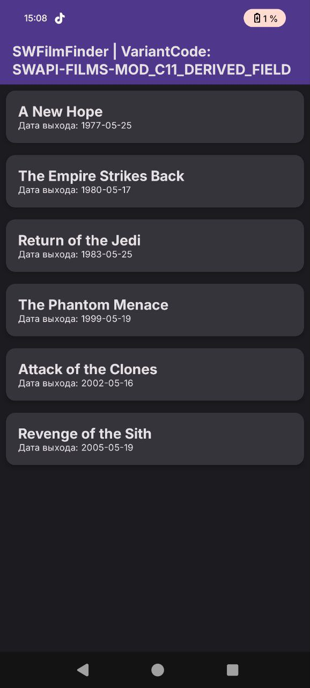
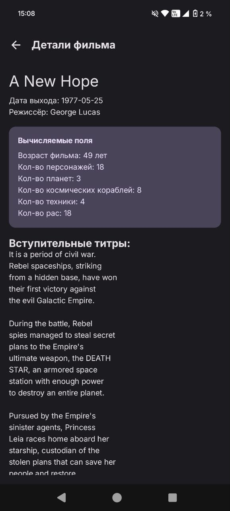

\# Задание на комиссию

Иванов Альберт Валерьевич

Б9123-09.03.03пикд(3)

SWAPI-FILMS-MOD\_C11\_DERIVED\_FIELD

SWFilmFinder

SWAPI - База данных фильмов по звёздным воинам (только по первым шести фильмам)

Для запуска ключ не требуется

Endpoints: /films для списка, /films/{id} для деталей отдельного фильма

Модификатор: MOD\_C11\_DERIVED\_FIELD

Вычисляемое поле: показывать derived value (например, длина названия, возраст по дате, кол-во связанных элементов).

В приложении вычисляется возраст фильма, а так же количество элементов (персонажи, корабли, техника, расы, планеты)

